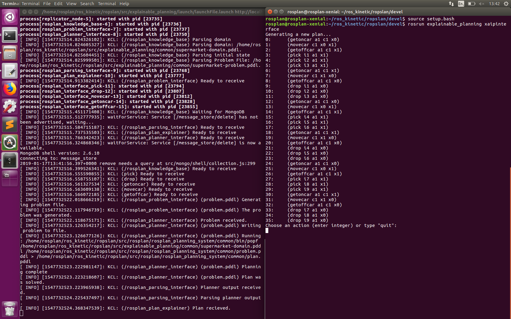

# Autonomous Supermarket
## Artificial Intelligence Planning
### POPF planner and XAIP framework from [KCL](https://nms.kcl.ac.uk/planning/)

This is a model of an autonomous supermarket where agents have the task to move items around, perhaps pick some items from the inventory and drop the items at a till where a customer can collect them.

The scenario is consist of number of agents who can move around by a car and pick limited number of items and drop the items at a location

durative actions used in the domain:
- durative-action pick: the agent can pick an item if they are at the same location and number of items that the agent is carrying is less than their capacity
- durative-action drop: the agent can drop the items at a location and this result in decreasing the number of items they are carrying
- durative-action movecar: the agent can move from a point to another with a car once they get on the car
- durative-action getoncar: the agent can get on a car if there is no other agent on it
- durative-action getoffcar: the agent can get off a car

 
